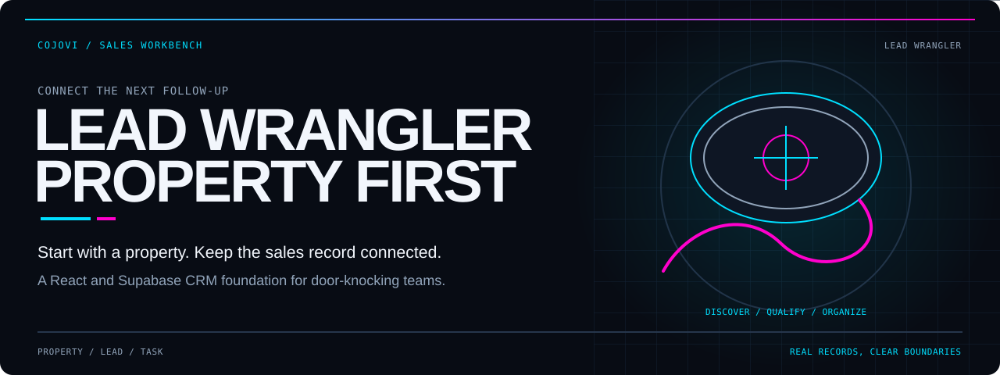
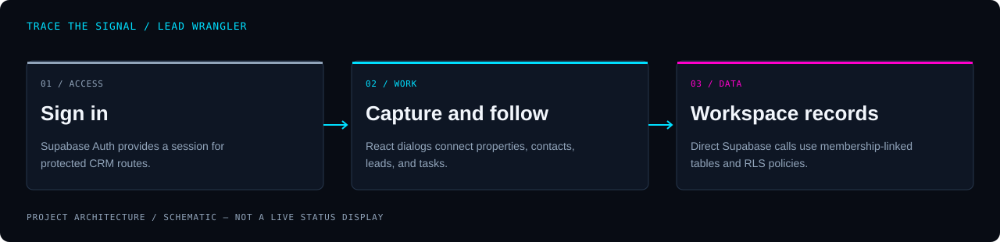

<!-- COJOVI / SIGNAL — Lead Wrangler project edition. Keep readme-assets/ with this file. -->
<!-- Presentation for the cojovi fork; upstream identity and contributor credit retained. -->
<a name="top"></a>

<p align="center">
  
</p>

<h1 align="center">Lead Wrangler</h1>

<p align="center">
  <strong>Start with the property. Keep the lead and the follow-up connected.</strong><br>
  A Texas-themed CRM foundation for door-knocking and sales teams, in texas-lead-roper.
</p>

<p align="center">
  
</p>

<p align="center">
  <a href="#overview">Overview</a> ·
  <a href="#architecture">Architecture</a> ·
  <a href="#quickstart">Preparation</a> ·
  <a href="#configuration">Configuration</a> ·
  <a href="#usage">Workflow</a> ·
  <a href="#validation">Validation</a> ·
  <a href="#security">Security</a>
</p>

---

<a name="overview"></a>
## `> meet_the_wrangler`

**Lead Wrangler organizes sales work around property records.** The application includes Supabase-backed lists and creation dialogs for properties, contacts, leads, opportunities, service tickets, and tasks, plus lead editing and door-knock logging.

This repository is [cojovi's fork](https://github.com/cojovi/texas-lead-roper) of [CodyCMAC/texas-lead-roper](https://github.com/CodyCMAC/texas-lead-roper). It retains the Lead Wrangler product identity and the original **Cojovi & AlinaCode** credit.

| Capture | Follow up | Coordinate |
| :--- | :--- | :--- |
| Add properties and contacts, create a lead, or log a door knock. | Edit lead notes, status, assignment, tags, and follow-up date. | Create opportunities, service tickets, and tasks within a workspace-backed schema. |

> [!IMPORTANT]
> **The CRM has real database operations and illustrative UI in the same application.** Dashboard metrics, recent activity, reports, and notification examples are not live business analytics. AI scoring/automation and downloadable estimate generation are not implemented services in this revision.

<a name="architecture"></a>
## `> trace_the_lead`

<p align="center">
  
</p>

```text
Public landing page / email-password authentication
                         ↓
Protected React routes + CRM dialogs
├─ properties and contacts
├─ leads and opportunities
└─ service tickets, tasks, and door-knock updates
                         ↓
Supabase Auth + PostgreSQL
└─ workspace membership, row-level policies, and address helpers
```

[App.tsx](src/App.tsx) uses BrowserRouter and authenticated route wrappers. [AuthProvider.tsx](src/components/auth/AuthProvider.tsx) restores the session and listens for authentication changes. The browser calls Supabase directly through the generated [client.ts](src/integrations/supabase/client.ts).

The schema includes additional sales, project, attachment, and update structures; table presence is not a promise that each has a complete UI. No separate application API server or active realtime subscription pipeline is supplied.

<a name="quickstart"></a>
## `> prepare_a_workspace`

**Prerequisites:** Git, Node.js and npm compatible with Vite 5, and a separate Supabase development project. The manifest does not pin a Node engine version.

### 1. Clone this fork

```bash
git clone --branch main https://github.com/cojovi/texas-lead-roper.git
cd texas-lead-roper
```

### 2. Disconnect inherited configuration before previewing

The generated client embeds a project URL and browser key directly in source. [supabase/config.toml](supabase/config.toml) also identifies a project. Do not open a local copy against inherited infrastructure or assume a local browser means a local backend.

A real `.env` is tracked in this revision, and `.gitignore` does not exclude that filename. Treat its contents as private; do not reuse, print, or copy it into public documentation. Audit tracked configuration locally and establish safe ignore rules in a separate development copy.

### 3. Prepare your own backend deliberately

Have a maintainer review [supabase/migrations/](supabase/migrations/) before applying a reconciled migration plan to an empty development project. The history includes schema/RLS setup, default workspace assignment, and identity-specific lead reassignment—not just reusable schema.

One earlier `normalize_address` declaration places a defaulted argument before required arguments; a later migration corrects the order. Reconcile that earlier definition before attempting a clean migration replay. Do not assume a later correction can run if an earlier migration stops first.

Configure email/password authentication and allowed confirmation redirects for your development origin. Review the signup trigger's default-workspace enrollment and create authorized membership records before testing creation dialogs.

### 4. Replace client targeting, then install and preview

Regenerate or deliberately adapt [client.ts](src/integrations/supabase/client.ts) for your own project and browser-safe key. It currently reads constants, **not `import.meta.env`**; adding `.env.local` alone does not retarget it. Keep generated types consistent with the reviewed schema.

```bash
npm install
npm run dev -- --host 127.0.0.1
```

Use **http://127.0.0.1:8080** if available, or the address Vite prints. The explicit loopback flag overrides the configured all-interface listener. Loading the application initializes Supabase authentication; signup may send a confirmation email and form submissions may change records.

<a name="configuration"></a>
## `> set_the_boundary`

| Area | Source of truth |
| :--- | :--- |
| Backend destination | Constants in [client.ts](src/integrations/supabase/client.ts). |
| Auth sessions | Client options use `localStorage`, persistence, and token refresh. |
| Project metadata | [supabase/config.toml](supabase/config.toml); not a browser environment loader. |
| Database shape | [migrations](supabase/migrations/) and generated [types.ts](src/integrations/supabase/types.ts). |
| Membership | `workspaces`, `user_roles`, and the signup trigger. |
| UI/tooling | [vite.config.ts](vite.config.ts), [tailwind.config.ts](tailwind.config.ts), and [components.json](components.json). |

The database role enum contains `admin`, `manager`, `rep`, and `backoffice`. Most creation dialogs choose the first returned membership with `limit(1)`; this is not a complete workspace-switching experience.

Browser keys are visible to visitors by design; never substitute a service-role credential. RLS policies and grants must enforce the intended isolation independently of hidden controls.

Routes use browser history. Static hosting needs an SPA fallback to `index.html` for direct links to authenticated pages. `npm run build:dev` is available for a development-mode Vite build, not a separate backend deployment.

<a name="usage"></a>
## `> work_the_pipeline`

| Route | What is connected |
| :--- | :--- |
| `/` / `/auth` | Public landing and authentication; signed-in visitors redirect to the dashboard. |
| `/dashboard` | Illustrative statistics/activity plus links and workflow dialogs. |
| `/properties` | Database-backed property list, search, creation, and detail display. |
| `/contacts` | Database-backed contact list and creation. |
| `/leads` | Lead list and detail editing with linked property/contact data. |
| `/opportunities` | Opportunity list and creation linked to properties. |
| `/service` | Service-ticket list and creation. |
| `/tasks` | Task list and creation; completion toggles persist to the database. |
| `/reports` | Static presentation, not computed reporting or a working export service. |
| `/about-us` | Project information and contributor attribution. |

A useful manual evaluation is **property/contact → lead → follow-up/task → opportunity**. This is a conceptual sales workflow, not an automatic conversion engine. Use synthetic records in a private development workspace.

### Door knocks and estimates

[DoorKnockDialog.tsx](src/components/DoorKnockDialog.tsx) looks up a property, optionally creates one, then inserts a lead and an update. These are separate calls, not a transaction; later failure can leave earlier records behind.

Door-knock updates currently declare `entity_type: 'lead'` but store the property ID as `entity_id`; repair that association before relying on lead activity history.

Address matching needs reconciliation before relying on deduplication: the property form, lead form, and door-knock path construct hashes differently. The schema's workspace/hash uniqueness constraint does not make those differing inputs equivalent.

[EstimateDialog.tsx](src/components/EstimateDialog.tsx) calculates a total and displays a preview. Its generation handler shows a success message and resets the form; it does not save an estimate or generate a PDF.

<a name="validation"></a>
## `> check_before_launch`

Available maintenance commands:

```bash
npm run lint
npm run build
npm run preview -- --host 127.0.0.1
```

The build produces the Vite static bundle in `dist/`. Preview serves that bundle without changing the configured backend boundary.

**Application builds and tests were not run for this documentation work.** There is no test script or tracked CI workflow in the reviewed revision.

- [ ] Replace inherited project targeting and review all tracked configuration privately.
- [ ] Reconcile migration ordering, default arguments, and operational data updates.
- [ ] Validate signup confirmation, sign-in, sign-out, and session restoration.
- [ ] Make default enrollment and workspace selection explicit and authorized.
- [ ] Test cross-workspace access and each role's database permissions.
- [ ] Use one address-normalization/hash strategy across creation paths.
- [ ] Check partial failures and record relationships in door-knock/lead creation.
- [ ] Confirm task completion and lead edits persist for the intended role.
- [ ] Keep illustrative metrics and estimate messaging distinct from actual results.
- [ ] Check lint, build, keyboard access, mobile layouts, and route refresh behavior.

<a name="source-map"></a>
## `> explore_the_source`

| Path | Responsibility |
| :--- | :--- |
| [src/App.tsx](src/App.tsx) | Public/protected routes and shared providers. |
| [src/components/auth/](src/components/auth/) | Authentication form and session context. |
| [src/pages/](src/pages/) | CRM lists, landing page, reports, and project information. |
| [src/components/](src/components/) | Creation/detail dialogs, layout, and UI primitives. |
| [src/components/dashboard/](src/components/dashboard/) | Illustrative dashboard statistics and recent activity. |
| [src/integrations/supabase/](src/integrations/supabase/) | Generated browser client and database types. |
| [supabase/migrations/](supabase/migrations/) | Schema, policies, functions, and data migrations. |
| [package.json](package.json) | Scripts and dependencies; package name `vite_react_shadcn_ts`. |

<a name="security"></a>
## `> protect_the_contact`

Customer addresses, contact details, notes, and assignments are sensitive business records. Minimize collected data, restrict access, and avoid real records in screenshots or test fixtures. Public documentation should never expose project-specific endpoints, credentials, or individual records.

The migrations enable RLS and define workspace-aware policies, but their presence is not a verified security audit. Review helper functions, role assignment, automatic enrollment, and cross-table relationships together. A client-side route guard only controls navigation.

### Upstream and license

Upstream: **[CodyCMAC/texas-lead-roper](https://github.com/CodyCMAC/texas-lead-roper)**. Original project credit: **Cojovi & AlinaCode**. The application uses React, Vite, Supabase, Tailwind, and shadcn/ui tooling; retain applicable dependency notices.

The previous README states MIT licensing, but **no root `LICENSE` file is tracked in the reviewed revision**. Preserve that historical claim without treating missing license text as verified permission; ask the maintainer to supply or confirm the governing terms before redistribution.

---

<p align="center">
  
</p>

<p align="center">
  <strong>Connected properties. Intentional follow-up. Clear boundaries.</strong><br>
  <sub>A <a href="https://github.com/cojovi">Cody / cojovi</a> fork · <a href="https://cojovi.com">cojovi.com</a><br>
  Lead Wrangler · Cojovi & AlinaCode · Upstream: CodyCMAC/texas-lead-roper.<br>
  Presented in COJOVI / SIGNAL.</sub>
</p>

<p align="center"><a href="#top">↑ Back to the signal</a></p>
